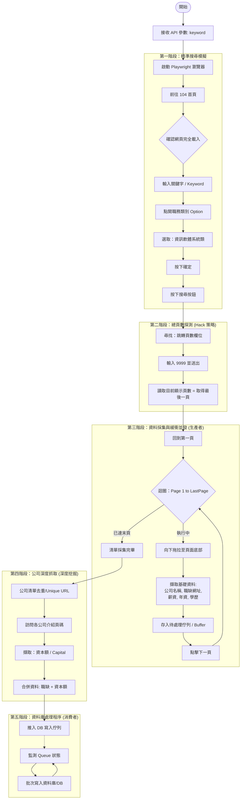

# 104 職缺挖掘機系統分析 (SA)

## 1. 爬蟲流程圖

我們將使用 Mermaid 語法來呈現您所述的動作邏輯，包含「探測最末頁」與「生產者-消費者」模式。

---

## 2. 詳細設計與實作規劃

### 2.1 搜尋精準度控制
*   **動態關鍵字**：將 `/api/scrape?keyword=php` 傳入，不寫死。
*   **類別選取**：我們會使用 Playwright 的 Selector (選擇器) 點擊「職務類別」，並精確定位到「資訊軟體系統類」。這能確保我們抓取的資料是經過 104 官方分類過後的精確職缺。

### 2.2 總頁數探測技巧 (9999 技巧)
*   這是一個非常聰明的做法。
*   **邏輯**：104 的分頁機制在接收到超出範圍的頁碼時，會自動修正回「最後一頁」。
*   **優點**：即使 104 頁面沒有直接告知總數，我們也能瞬間標記出任務終點。

### 2.3 解決延遲載入 (Lazy Loading)
*   104 的職缺標籤（Jobs）通常是捲動後才載入。
*   **動作：** 我們會實作 `page.evaluate` 或滾動指令，分段向下拉動，確保所有 DOM 元素（包含公司 URL、職缺連結）都已經 Render 出來後才進行 `query_selector_all`。

### 2.4 深度挖掘：資本額判定 (新需求)
*   **痛點**：104 的搜尋列表無法直接篩選「公司資本額」，這對於想找「大廠」或「特定規模新創」的開發者來說很不方便。
*   **對策**：
    1.  **去重複訪問**：在第一階段抓到的職缺中，許多職缺可能來自同一家公司。我們會先將「公司網址」進行 `set()` 去重，避免重複訪問同一家公司造成被封 IP 或浪費資源。
    2.  **二次爬取**：針對去重後的公司清單，啟動分頁訪問（或是開啟新 Tab），精確定位公司介紹頁中的「資本額」欄位。
    3.  **判定與分類**：抓取到的「億、千萬」等級字串會轉換為數值，方便後續在 Laravel 前台進行彈性的數值篩選（例如：只要 5000 萬以上的公司）。

### 2.5 多執行緒 / 生產者-消費者模式 (Producer-Consumer)
*   **技術選型**：使用 Python 的 `asyncio.Queue`。
*   **生產者**：Playwright 腳本。負責不斷把網頁上的資料轉成 JSON/Dictionary 丟進 Queue。
*   **消費者**：背景 Worker。負責監控 Queue，每當資料達到一定數量（例如 10 筆）時，使用 SQLAlchemy 或原生 SQL 進行一次 `executemany`。
*   **效益**：
    1.  **分離關注點**：爬蟲不用等 DB 寫完才抓下一頁。
    2.  **減少 DB 壓力**：避開頻繁的單筆 `INSERT`。

---

## 3. 資料庫欄位清單 (更新版本)
| 欄位名稱 | 說明 |
| :--- | :--- |
| `company_name` | 公司名稱 |
| `company_url` | 公司在 104 的連結 |
| `capital` | **資本額 (數值或字串，用於篩選準則)** |
| `job_title` | 職缺名稱 |
| `job_url` | 職缺詳細頁連結 |
| `salary` | 薪資範疇 |
| `experience` | 要求的年資 |
| `education` | 要求的學歷 |
| `search_keyword` | 當初使用的搜尋字 (例如: PHP) |
| `created_at` | 爬取時間 |

---
## 4. 下一步討論
*   **反爬蟲對策**：104 會有 Page Load 檢測，我們是否需要加入隨機變化的 User-Agent 或隨機延遲？
*   **資料去重**：如果同一個職缺在不同時間被爬到，是否要做更新（Update）還是忽略？
