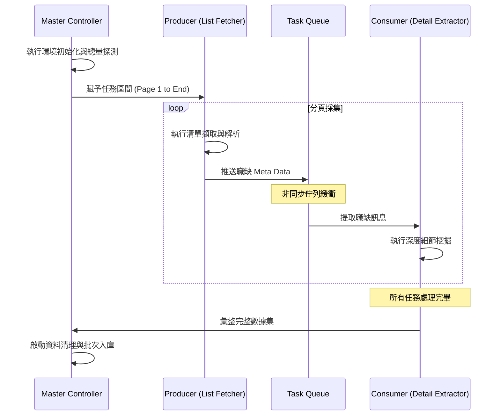

# 職缺挖掘機：系統設計規格書 (Software Design Specification)

## 1. 系統架構：生產者-消費者模式
本系統核心採用非同步併發架構，將爬取任務拆分為多個獨立運作的階段，以提升擷取效率。

### 階段職責定義
*   **探測階段 (Initialization & Probing)**:
    *   初始化瀏覽器環境並分析目標搜尋條件。
    *   評估當前任務的總規模（總頁數與總筆數），提供任務進度評估基準。
*   **生產者 (Producer - List Fetcher)**:
    *   負責廣度爬取。遍歷搜尋分頁並擷取初步職缺物件。
    *   執行網頁滾動與分頁導航邏輯，確保動態內容完整載入。
    *   將擷取到的初步資訊封裝為任務訊息後，推入非同步記憶體佇列 (Task Queue)。
*   **消費者 (Consumer - Detail Extractor)**:
    *   負責深度爬取。訂閱 Task Queue 並提取職缺訊息。
    *   執行進階數據擷取 (如：深度訪問公司頁面以獲取資本額等隱藏欄位)。
*   **數據整合與持久化 (Data Aggregator & Persistence)**:
    *   負責將多階段採集的資料進行清洗、格式化處理。
    *   執行批次寫入 (Batch Insert) 至資料庫，確保數據一致性並優化資料庫效能。

## 2. 數據流時序圖 (UML Sequence Diagram)

## 3. 技術設計原則
*   **單一職責原則 (SRP)**: 每個模組專注於特定路徑的擷取或處理，降低代碼耦合。
*   **並發優化**: 透過 Python asyncio 機制平行化網路請求，極大化資源利用率。
*   **容錯機制**: 各階段應具備基礎的錯誤攔截與日誌記錄，不應因單筆資料錯誤導致整體管線崩潰。
