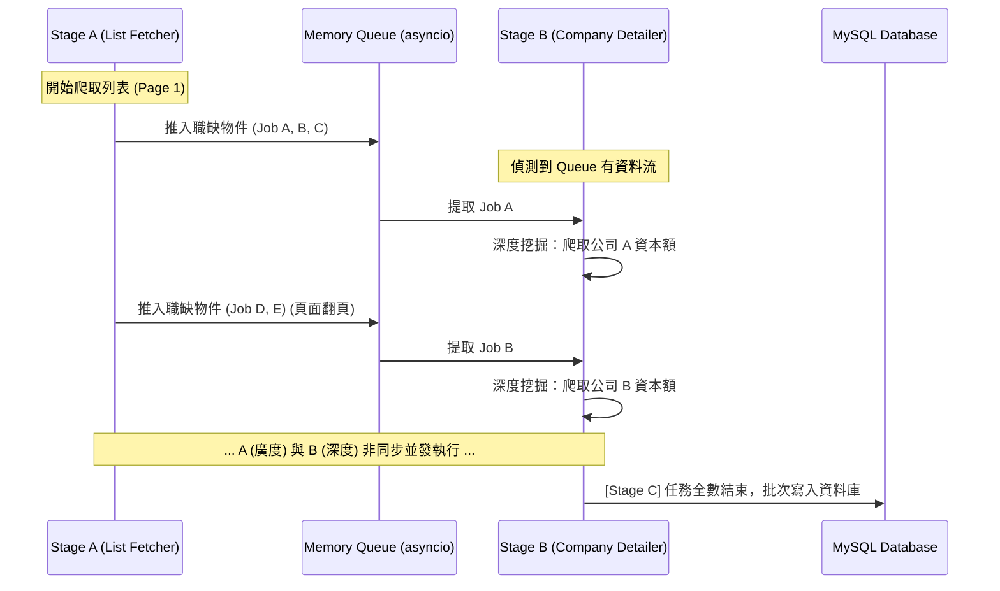

# 職缺挖掘機：系統設計規格書 (Software Design Specification)

## 1. 架構模式：生產者-消費者模型 (Producer-Consumer Pattern)
為了提升爬蟲效率並降低資料庫 (DB) 壓力，本專案採用基於「非同步記憶體佇列」的並發模型。這允許不同階段的爬蟲任務可以重疊執行，而不需要互相等待。

### 角色定義
*   **Producer (生產者 - Stage A)**: `ListFetcher` 模組。
    *   負責在 104 搜尋列表頁進行廣度掃描。
    *   將抓到的初步資料（如職缺 URL, 公司 URL）封裝成訊息，推入 `asyncio.Queue`。
*   **Buffer (傳輸緩衝)**: `asyncio.Queue`。
    *   一個執行緒安全 (Thread-safe) 的記憶體佇列。
    *   作為 A 與 B 階段之間的解耦層。
*   **Consumer (消費者 - Stage B)**: `CompanyDetailer` 模組。
    *   持續監測 Queue。一旦有資料進入，立即啟動另一組瀏覽器行為前往公司分頁抓取資本額。
    *   處理完後將資料傳遞給 Collector。
*   **Collector & Committer (收集與寫入 - Stage C)**:
    *   收集所有階段完成的最終資料。
    *   累積到一定數量後執行 **「批次寫入 (Batch Insert)」**。

## 2. 系統元件時序圖 (UML Sequence Diagram)

## 3. 技術優勢與設計考量
*   **非阻塞 I/O (Non-blocking I/O)**: 
    不需等待所有的職缺列表都抓完才開始抓公司詳情。當清單抓到第 2 頁時，第 1 頁的公司詳情可能已經處理完畢，大幅縮短總作業時間。
*   **DB 寫入效能**: 
    透過批次寫入 (Batch insert) 降低資料庫連線次數與索引更新壓力。
*   **解耦 (Decoupling)**: 
    Stage A 不需要知道 Stage B 是如何運行的，雙方只透過預定義的資料格式進行通訊。

## 4. 異常處理 (Exception Handling)
*   **斷網重試**: 針對 Playwright 的導覽失敗需實作 Retry 機制。
*   **優雅退出**: 使用 `Queue.join()` 確保所有傳輸內的職缺都處理完畢後，再啟動最後的 DB 寫入與資源釋放。
