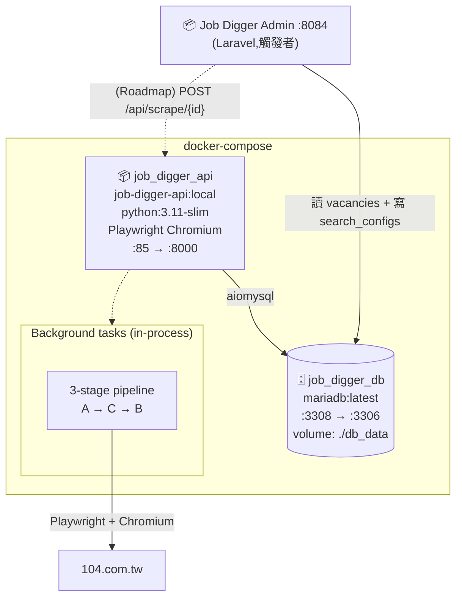
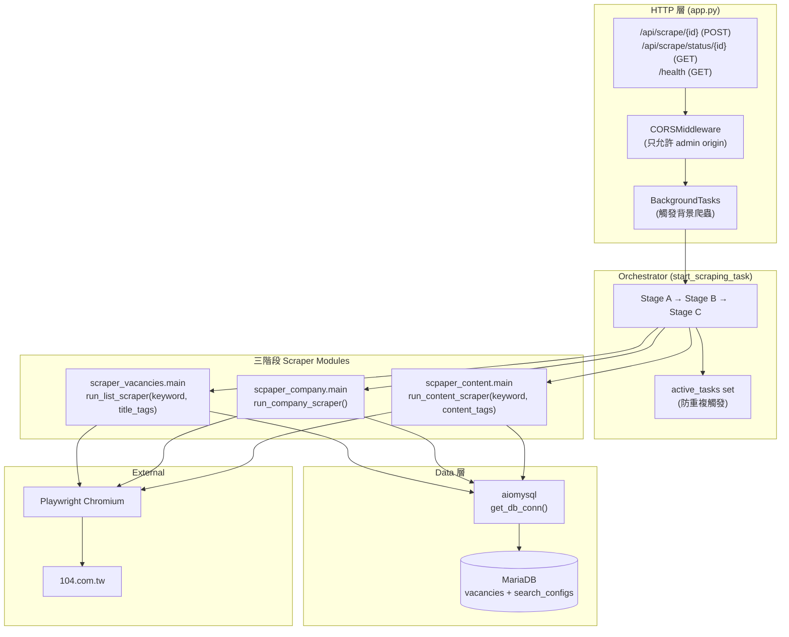
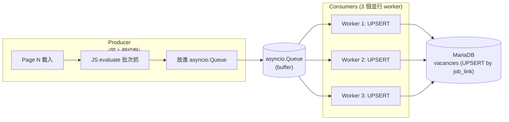

# Architecture

本文件描述 Job Digger 的整體架構、三階段 pipeline、與生產者-消費者模型。融合了原 [SD_Crawler_Architecture.md](./legacy/SD_Crawler_Architecture.md) 的內容(已 supersede,保留在 legacy/)。

目標讀者:**開發者、Architect、想理解爬蟲設計或反爬策略的 Reviewer**。

---

## Level 1 — System Context

「這個系統服務誰、又依賴誰?」見 [`overview.md` 第 2 節](./overview.md#2-在生態裡的位置)。

---

## Level 2 — Container Diagram

「打開系統,裡面有哪些獨立部署單元?」

**容器規格**

| 容器 | 角色 | Host Port | Container Port |
|---|---|---|---|
| `job_digger_api` | FastAPI + 三階段爬蟲 | **85** | 8000 |
| `job_digger_db` | MariaDB(共用 with admin)| **3308** | 3306 |

> **為何 API 跟爬蟲在同一個容器**:背景任務用 FastAPI `BackgroundTasks` 在同 process 跑,沒拆 worker 容器。對單機規模(我自己用)夠了;規模大可以拆 RQ/Celery + Redis(對應 [adr/0001-fastapi-vs-django.md](./adr/0001-fastapi-vs-django.md) 的 Roadmap)。

---

## Level 3 — Component Diagram(內部分層)

**分層職責**

| 層 | 路徑 | 該做什麼 | 不該做什麼 |
|---|---|---|---|
| **HTTP** | `app.py` | 接 POST → 驗 config 存在 → dispatch background | 業務邏輯、爬蟲細節 |
| **Orchestrator** | `app.py::start_scraping_task` | 三階段順序、active_tasks 追蹤、例外 swallow | 直接打 Playwright |
| **Scrapers** | `scraper_vacancies/` `scpaper_content/` `scpaper_company/` | 操作 Playwright + 資料抽取 + 寫 DB | 跨階段協調 |
| **Data** | `app.py::get_db_conn` + scraper 內 SQL | aiomysql 連線、UPSERT | 商業邏輯 |

> **三個 scraper 模組都各自寫 DB**(用 `get_db_conn`),而不是統一由 Orchestrator 收 queue 寫。因為三階段的寫入內容不同(A 寫 vacancies 主檔、B 寫公司欄位、C 更新 check_type),用同個 worker 反而要傳一堆狀態。

---

## Level 4 — 核心架構:生產者-消費者模型(Stage A 內部)

雖然「三階段」是巨觀流程,但 **Stage A 內部還有一個生產者-消費者** — 因為清單採集要平衡「網頁載入慢」跟「DB 寫入快」。

**設計重點**

| 元件 | 設計理由 |
|---|---|
| **單一 Producer** | 104 翻頁本身是 sequential,並行翻頁容易被偵測為機器人 |
| **3 個 Consumer** | DB UPSERT 雖然快,但 1 個 worker 跟不上 producer 的批次速度,3 個是 sweet spot |
| **asyncio.Queue 不限大小** | producer 翻完整個 keyword(可能 1k 筆)記憶體還能裝得下,不必 backpressure |
| **UPSERT (ON DUPLICATE KEY UPDATE)** | 重跑爬蟲不會重複插入(`job_link` 是 unique) |

---

## Level 5 — 三階段 Pipeline 詳述

### Stage A — 清單採集(Producer)

`scraper_vacancies/main.py::run_list_scraper(keyword, title_tags)`

1. **末頁探測 hack** — 在跳轉欄位輸入 `9999`,讓 104 顯示真實末頁(避免 brute-force 翻頁)
2. **逐頁抓** — 每頁向下捲動觸發 JS render,然後 `page.evaluate` 一口氣抽出所有職缺卡片
3. **錨點回溯** — 從 `.info-job__text` 元素往上找最近的職缺卡片容器(避免 hardcode XPath)
4. **第一道過濾** — 檢查標題是否含 title_tags 任一個,不含就跳過(在 producer 端就過濾,減少寫入量)
5. **寫進 vacancies**(只填 title / company / job_link / salary,公司詳細資訊空著等 Stage C)

詳細時序見 [`sequence-diagrams.md` 第 1 節](./sequence-diagrams.md#1-stage-a-清單採集-producer-consumer)。

### Stage B — 內文深度過濾

`scpaper_content/main.py::run_content_scraper(keyword, content_tags)`

1. 從 DB 撈出 Stage A 寫入但 `check_type IS NULL` 的 vacancies
2. 對每筆打開 job_link 看內文
3. 用更深的關鍵字比對(內文長度 > 標題,可以驗證是否真的是該領域)
4. 寫 `check_type` 欄位:`pass` / `keyword_mismatch` / `seniority_mismatch` 等
5. **不刪除不通過的紀錄** — 保留作為 audit trail

> **為何 C 在 B 之前**:先過濾掉不要的職缺,才不用浪費時間在不要的職缺上補公司資料。

### Stage C — 公司資料補全(Explorer)

`scpaper_company/main.py::run_company_scraper()`

1. **去重撈取**:`SELECT DISTINCT company_link FROM vacancies WHERE capital = '0' OR employee_count = ''`
2. 對每個 company_link 開頁面
3. 找 `.intro-table__head` 標籤,比對「資本額」「員工人數」
4. 鎖定父節點下的 `.t3.mb-0` 內容
5. 批次 UPDATE 回 vacancies(同一家公司的所有職缺一起更新)

> **去重是關鍵**:同個 keyword 可能 100 個職缺只屬於 20 家公司,如果不去重就會重複點 100 次公司頁,白白消耗 4-5 倍時間 + 提高被反爬的機率。

---

## 6. 跨系統互動(摘要)

| 互動場景 | 對手 | 介面 |
|---|---|---|
| Admin 觸發爬蟲(Roadmap)| Job Digger Admin | HTTP `POST /api/scrape/{config_id}` |
| Admin 查爬蟲狀態 | 同上 | HTTP `GET /api/scrape/status/{config_id}` |
| 健康檢查 | k8s / Ops | HTTP `GET /health` |
| 讀 search_configs | DB(共用) | aiomysql `SELECT ... WHERE id = ?` |
| 寫 vacancies | DB(共用) | aiomysql UPSERT |
| 爬 104 | site | Playwright Chromium |

詳細時序圖見 [`sequence-diagrams.md`](./sequence-diagrams.md)。

---

## 7. 技術棧一覽

| 類別 | 技術 |
|---|---|
| 語言 | Python 3.11 |
| Web Framework | FastAPI(自帶 OpenAPI / Swagger UI on `/docs`)|
| Async | `asyncio` |
| 爬蟲引擎 | Playwright(Chromium) + playwright-stealth |
| DB Driver | `aiomysql`(async MySQL/MariaDB client)|
| DB | MariaDB latest |
| 容器 | Docker multi-stage(builder 用 python:3.11-slim) |
| Lint / Format | `flake8` + `black` + `isort` |
| Pre-commit | `pre-commit` 框架 |

---

## 8. Roadmap / 已知架構限制

| 項目 | 現況 | 下一步 |
|---|---|---|
| 沒 schedule | 被動觸發(等 Admin 點按鈕) | 加 cron / Celery beat |
| BackgroundTasks 在同 process | 重啟 API 會中斷正在跑的爬蟲 | 拆 RQ / Celery worker 容器 |
| 沒進度回報 | Admin 只能 polling status,看不到「跑到第幾頁」 | 加 WebSocket / SSE 推進度 |
| 反爬只用 stealth | 沒處理 IP rotation | 評估 proxy pool / 拉長間隔 |
| 同個 IP 跑太久會被 ban | 目前單機 | 加 IP 輪換 |
| 失敗重試 | 沒 — 拋例外只記 log | 加 retry decorator(重試 3 次,指數 backoff) |
| 觀測性 | print 到 docker log | 加結構化 log + Prometheus metrics |
